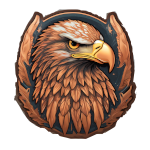

 

 
 

##  About me

Welcome to my Github Profile! I am a computer science student. During my free time, I enjoy programming and learning about new technologies 💻. 

If you want to know more, please stand by! The profile is in active development 😁...

## Pinned

    
    

<!--
**CopperEagle/CopperEagle** is a ✨ _special_ ✨ repository because its `README.md` (this file) appears on your GitHub profile.

Here are some ideas to get you started:

- 🔭 I’m currently working on ...
- 🌱 I’m currently learning ...
- 👯 I’m looking to collaborate on ...
- 🤔 I’m looking for help with ...
- 💬 Ask me about ...
- 📫 How to reach me: ...
- 😄 Pronouns: ...
- ⚡ Fun fact: ...
-->

